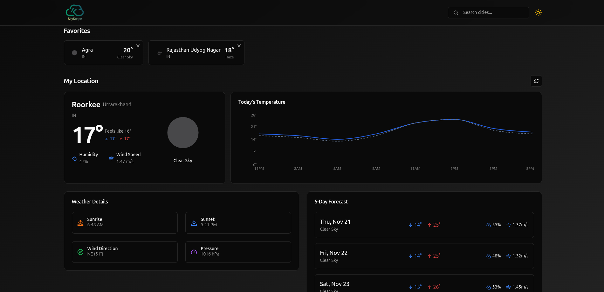
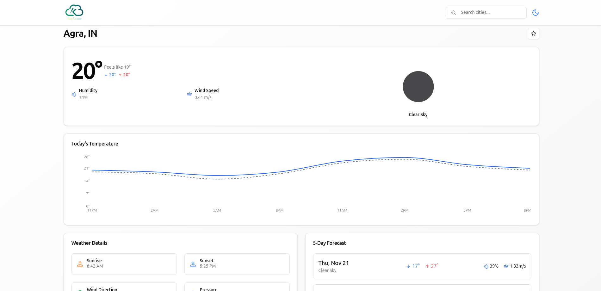
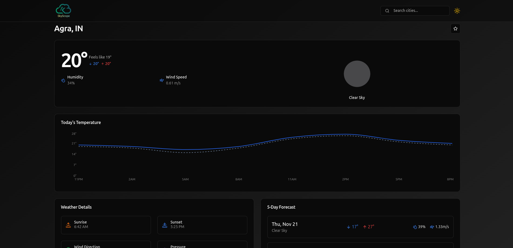
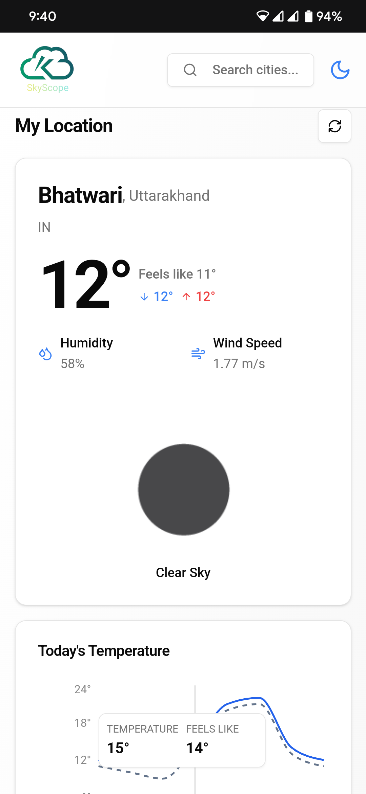
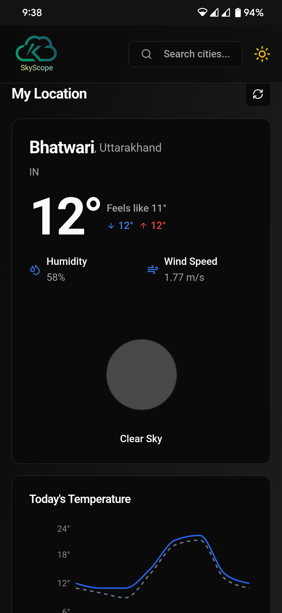

# 🌦️ SkyScope - Build Your Own Weather App

<a href="https://myskyscope.netlify.app/" target="_blank">
  
</a>


Welcome to **SkyScope**! This tutorial will guide you step-by-step in mastering cutting-edge technologies like **ReactJS**, **TypeScript**, **TanStack Query**, and **ShadCN UI**. Together, we'll create a beautiful, fully functional weather app with interactive features and deploy it to a custom domain for showcasing! 🌐

## 🚀 Project Overview
In this tutorial, you’ll learn to build a modern weather application packed with powerful features:
- 🌍 **Real-time Weather**: Get accurate weather data for your current location or any city in the world.
- 🔎 **City Search**: Search for weather details by entering a city's name.
- 📈 **24-Hour Forecast Graph**: Visualize hourly temperature changes for better insights.
- ⭐ **Favorites & Search History**: Use TanStack Query to save your favorite cities and view past searches with ease.
- 🌑 **Dark & Light Mode**: Switch between light and dark themes for a personalized UI experience.
- 📱 **Responsive Design**: Enjoy a seamless, user-friendly design on any device, powered by ShadCN UI and React.

## 🛠️ Technologies Used
- **ReactJS**: For building the user interface.
- **TypeScript**: Ensuring type safety and reducing errors.
- **TanStack Query**: Enabling data fetching, caching, and mutations for search history and favorites.
- **ShadCN UI**: Creating a beautiful and responsive design with pre-built components.
- **Vite**: Fast and modern development environment for front-end projects.

## ✨ Key Features
- **Search any city** 🌆: Find weather information for any city around the world.
- **Current location weather** 📍: Automatically display weather based on your device’s location.
- **Favorites** ⭐: Save your favorite cities for quick access.
- **Light & Dark Mode** 🌞🌜: Toggle between themes to suit your preference.
- **Graphical Forecast** 📊: See an hourly temperature forecast with a visually appealing graph.

## 📚 Tutorial Highlights
- Setting up a new project with **Vite**: Initialize your React app in seconds.
- **TypeScript integration**: Add TypeScript for robust, error-free coding.
- Building a sleek **UI with ShadCN**: Create a beautiful interface that's responsive and accessible.
- **Data management** with **TanStack Query**: Learn advanced data handling for search, caching, and mutations.
- **Deploying to a custom domain**: Showcase your project with a personalized domain.

## 📸 Screenshots
### Light Mode 🌞 | Dark Mode 🌜
| Light Mode | Dark Mode |
|------------|-----------|
|  |  |

### Mobile Views 📱
| Light Mode | Dark Mode |
|------------|-----------|
|  |  |

## 🚀 Getting Started
To set up this project locally:

1. Clone this repository:
   ```bash
   git clone https://github.com/ORE0000/SkyScope.git
   cd SkyScope
   ```

2. Install dependencies:
   ```bash
   npm install
   ```

3. Start the development server:
   ```bash
   npm run dev
   ```

4. Open your browser at `http://localhost:3000` to view the app.

## 🔧 Installation
You can create a new project with Vite by running:
```bash
npm create vite@latest
```

## 🛡️ Environment Variables
To protect your API keys, create a `.env` file in the root directory and add your API keys like this:
```bash
REACT_APP_WEATHER_API_KEY=your_api_key_here
```
Ensure your `.env` file is **never pushed to GitHub** by adding it to `.gitignore`:
```bash
# .gitignore
.env
```

Enjoy building your own **SkyScope** weather app! 🌦️ Let’s bring your coding skills to the next level with a real-world project you can proudly showcase.
